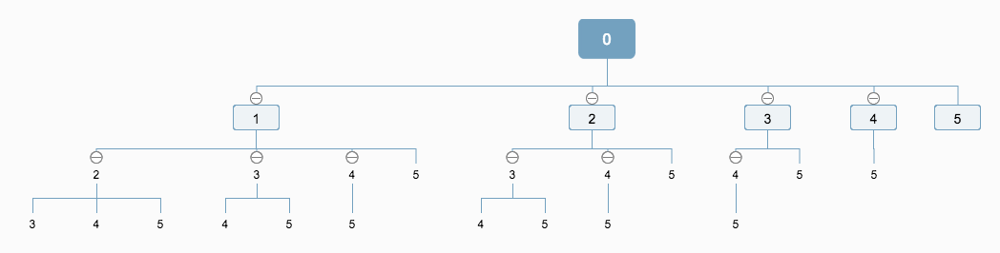

## Question

https://leetcode.com/problems/combinations/

Give two integer n and k (k <= n), return all possible combinations of k numbers out of 1 … n.

For example, if n = 4 and k = 2, a solution is:

```
[
  [2,4],
  [3,4],
  [2,3],
  [1,2],
  [1,3],
  [1,4],
]
```

## Explain

Below is a example when n = 5, and k = 3. Here we draw a tree diagram of the combination to show how to compose all combinations manually (_here we add 0 as the root is only for mathematical convenience_):



The building process of this tree is actually a DFS process.

The search principles are pretty simple:

- each child must greater than its parent
- each child mustn't greater than n
- find as many children as possible

If the depth of a leaf is k, the leaf and all its parents (without root node) becomes a valid combination,
Such as the `0 -> 1 -> 2 -> 3` and `0 -> 1 -> 3 -> 5` are valid ones. `0 -> 3 -> 5` is not valid because the depth of leaf `5` is 2, not 3.

Find all the valid combinations, and we will reach our final goal.

## Sample Code

```js
/**
 * @param {number} n
 * @param {number} k
 * @return {number[][]}
 */
var combine = function(n, k) {
    return comb(0, [], n, k, []);
};

function comb (parent, path, n, k, result) {
    // Return because we don't have to search further.
    if (path.length === k) return result.push(path);

    // Each child must greater than its parent.
    // Each child mustn't greater than n.
    // Here we traverse the tree from right to left.
    for (var i = n; i >= parent + 1; i--) {
        comb(i, path.concat(i), n, k, result);
    }

    return result;
}
```